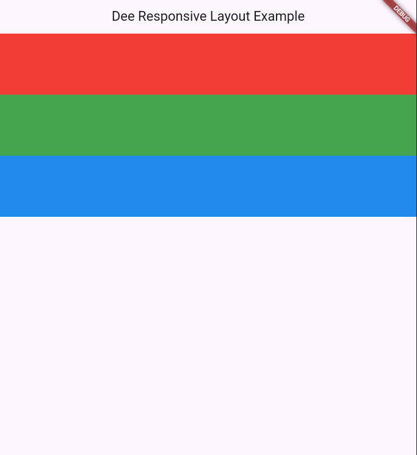

# Dee Responsive Layout

`dee_responsive_layout` is a Flutter library for creating responsive layouts using a column system, similar to Bootstrap. It helps you create user interfaces that automatically adapt to different screen sizes.


| Desktop               | Tablet                          | Smartphone                         |
|----------------|-------------------------------|-----------------------------|
||||

## Instalation

Add the dependency to your file `pubspec.yaml`:

```yaml
dependencies:
  flutter:
    sdk: flutter
  dee_responsive_layout: #latest
```

## Use
Import the library into your Dart file:

```dart
import 'package:dee_responsive_layout/dee_responsive_layout.dart';
```

## Example
Here is a basic example of how to use `DeeResponsiveLayout` with `DeeResponsiveColumn`:

``` dart
import 'package:flutter/material.dart';
import 'package:dee_responsive_layout/dee_responsive_layout.dart';

void main() {
  runApp(MyApp());
}

class MyApp extends StatelessWidget {
  @override
  Widget build(BuildContext context) {
    return MaterialApp(
      home: Scaffold(
        appBar: AppBar(title: Text('Dee Responsive Layout Example')),
        body: DeeResponsiveLayout(
          children: [
            DeeResponsiveColumn(
              sm: 6,
              md: 4,
              lg: 3,
              xl: 2,
              child: Container(color: Colors.red, height: 100),
            ),
            DeeResponsiveColumn(
              sm: 6,
              md: 4,
              lg: 3,
              xl: 2,
              child: Container(color: Colors.green, height: 100),
            ),
            DeeResponsiveColumn(
              sm: 12,
              md: 8,
              lg: 6,
              xl: 4,
              child: Container(color: Colors.blue, height: 100),
            ),
          ],
        ),
      ),
    );
  }
}
```

## Library Structure

### DeeResponsiveColumn
`DeeResponsiveColumn` is used to define responsive columns.

``` dart
DeeResponsiveColumn({
  required Widget child,
  int sm = 6,
  int md = 8,
  int lg = 10,
  int xl = 12,
  Alignment alignment = Alignment.topLeft,
});
```

- `child`: The child widget that will be rendered inside the column.
- `sm`: Number of columns on small screens.
- `md`: Number of columns on medium screens.
- `lg`: Number of columns on large screens.
- `xl`: Number of columns on extra large screens.
- `alignment`: The alignment of the widget inside the column.

### DeeResponsiveLayout
`DeeResponsiveLayout` is used to arrange the DeeResponsiveColumn in a responsive layout.

``` dart
DeeResponsiveLayout({
  required List<DeeResponsiveColumn> children,
});
```

- `children`: List of DeeResponsiveColumn that will be arranged in the layout.


## Internal Functions
- `_getColumnCount`: Calculates the number of columns based on the screen width.
- `_buildRows`: Builds the rows (Row) of widgets (DeeResponsiveColumn), adjusting the number of columns and alignment.
- `_getRowAlignment`: Converts the Alignment alignment to CrossAxisAlignment.

## License
This project is licensed under the MIT license - see the LICENSE file for more details.

## Contribution
Contributions are welcome! Please open an issue or submit a pull request.

## Author
Developed by [Raphael Pontes]('https://www.linkedin.com/in/raphaelkennedy/')